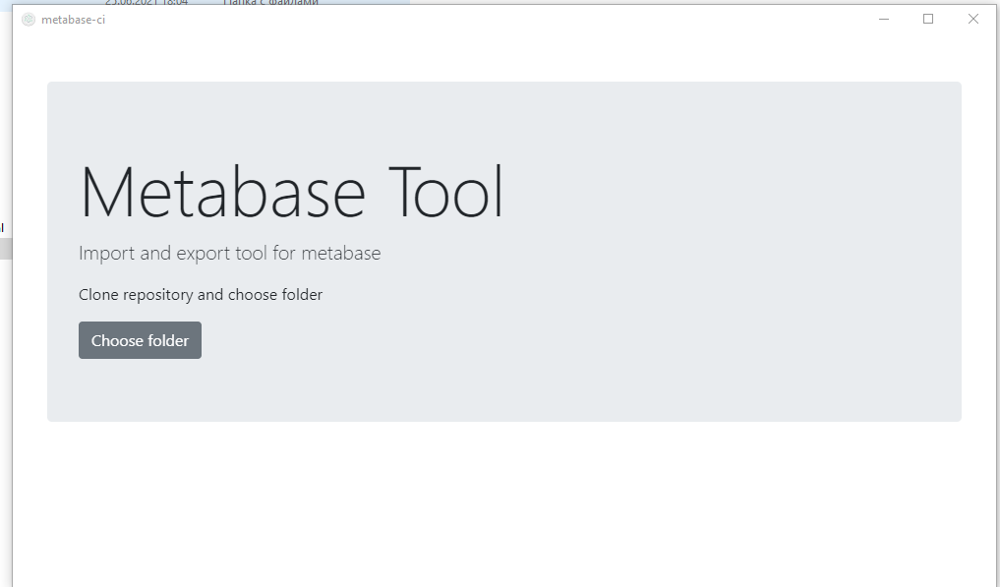
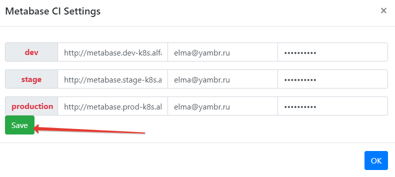
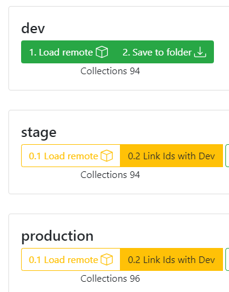

# metabase ci tool
Git+metabase - now works with cards and dashboards (create and update)
### What i can do with this tool?
- store you cards and dashboards in git repository
- manual deploy and configuration with desktop tool 
- automatic deploy (with you runner) from repository

> An electron-vue project (+bootstrap)
> And node console tool for CI/CD

#### Build Setup

``` bash
# install dependencies
npm install

# serve with hot reload at localhost:9080
npm run dev

# build electron application for production
npm run build

# run unit & end-to-end tests
npm test


# lint all JS/Vue component files in `src/`
npm run lint

```
using 
- metabase rest api
- nodejs
- electron (for desktop app)
---
## How it works?
### 1. Prepare you environments
0. Be sure dev and stage environments equal to production (you can restore backup to dev and stage from production)
1. create new empty git repository
2. Open "metabase-ci" (desktop app - you can build from this repository)
3. Choose repository folder

4. Configure metabase envs in settings (enter url and credentials)


**Load and link ids from environments**

1. Load remote for dev and Save to folder (*commit to see changes in repo*)
2. Load remote for stage and Link Ids with Dev (*commit to see changes in repo*)
3. Load remote for production and Link Ids with Dev (*commit to see changes in repo*)
   


**Congrats! Now you have repo with you metabase items**

### 2. Develop some changes in dev 
0. Open you metabase site (only dev) - and change you some collection or card or dashboard
1. Open "metabase-ci" (desktop app - you can build from this repository)
2. Click Load remote for dev and Save to folder (*commit to see changes in repo*)

**Now you can see you changes in repo**

### 3. Manual publishing 
*stage for example*
1. Open "metabase-ci" (desktop app - you can build from this repository)
2. Click Publish Remote for stage (*commit to see changes in repo*)
*publishing adding new ids from environment - don't forget commit them*
   
### 4 Automatic publishing
[console tool](src/ci/README.md) - using logic like manual publishing


